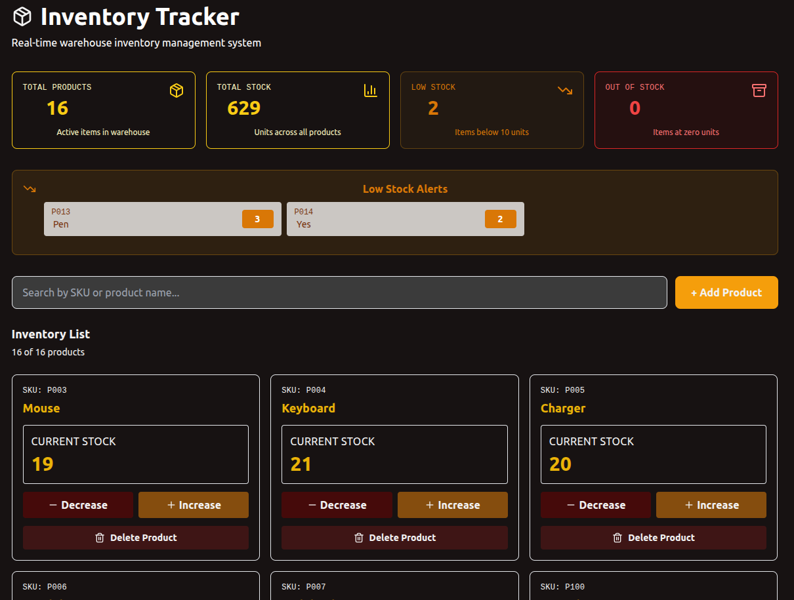
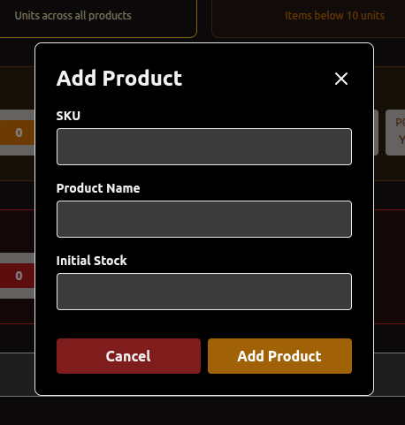
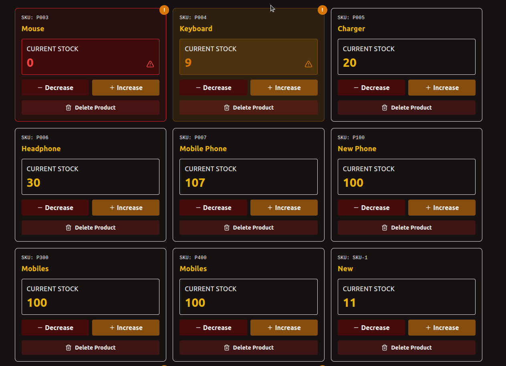
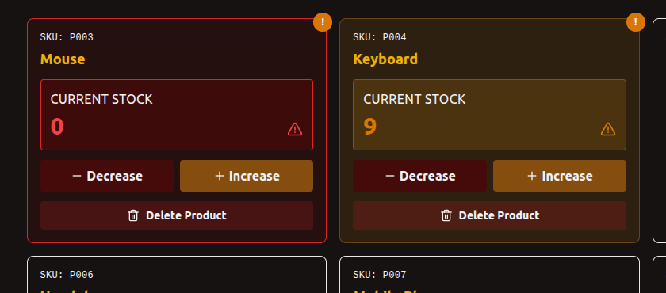

# Warehouse Inventory Dashboard

This project is a **Single Page Application (SPA)** for managing warehouse inventory. It allows a manager to **view, add, update, and delete products**, as well as track low stock and out-of-stock items in real time. The project is built with **MERN stack**, **TypeScript**, **Tailwind CSS**, **Redux Toolkit**, and **Redux Saga**.

---

## **1. Project Setup Instructions**

### **Backend (Node.js + Express + MongoDB)**

1. Navigate to the backend folder:
      cd backend

3. Install Dependencies:
      npm install

5. Create a .env file in the backend  with the following variables:
      PORT=5000
      MONGODBURL=<your_mongodb_connection_string>

6. Start server:
      node server.js

### **Front End setup (React + Typescript + Tailwind Redux)**
1. Navigate to folder:
      cd frontend

2. Install dependencies:
      npm install 

3.  Start server: 
      npm run dev

## **2. Redux Workflow**

The flow is breifly explained below;

1. User updates stock,
      The dashboard dispatches;
          updateStockRequest({ productid, quantity })
 
2. Saga intercepts the action,
      updateStockSaga listens for this request and performs:
          PATCH /api/products/:id/stock

3. Backend updates Database, 
      Mongoose updates the product and returns the updated object.

4. Saga dispatches result,
      On success;
          updateStockSuccess(updatedProduct)
      & On failure;
          updateStockFailure({ productId, error })

5. Slice updates the redux store,
      The product list is updated, loading flags reset, and errors stored if needed.

6. React re-renders  automatically
      Components using useSelector display the latest stock and updated dashboards.

## **3. Design Decision**

### Responsive UI 
    - Tailwind CSS was chosen for fast, utility-first styling.
    - Color-coded alerts (yellow for low stock, red for out-of-stock) improve usability and quick decision-making.

### State Management 
    - Redux Toolkit provides clean reducers and predictable state updates.
    - Redux Saga centralizes all asynchronous logic (CRUD operations), keeping components simple and improving maintainability.

### Architecture Choices
    - TypeScript ensures type-safe CRUD operations.
    - Component structure (Dashboard, ProductCard, AddProduct) improves reusability and clarity.

## **4. UI Screehshots**
### Dashboard

### Add Product Form

### Product Card 

### Low & Out of Stock Products

